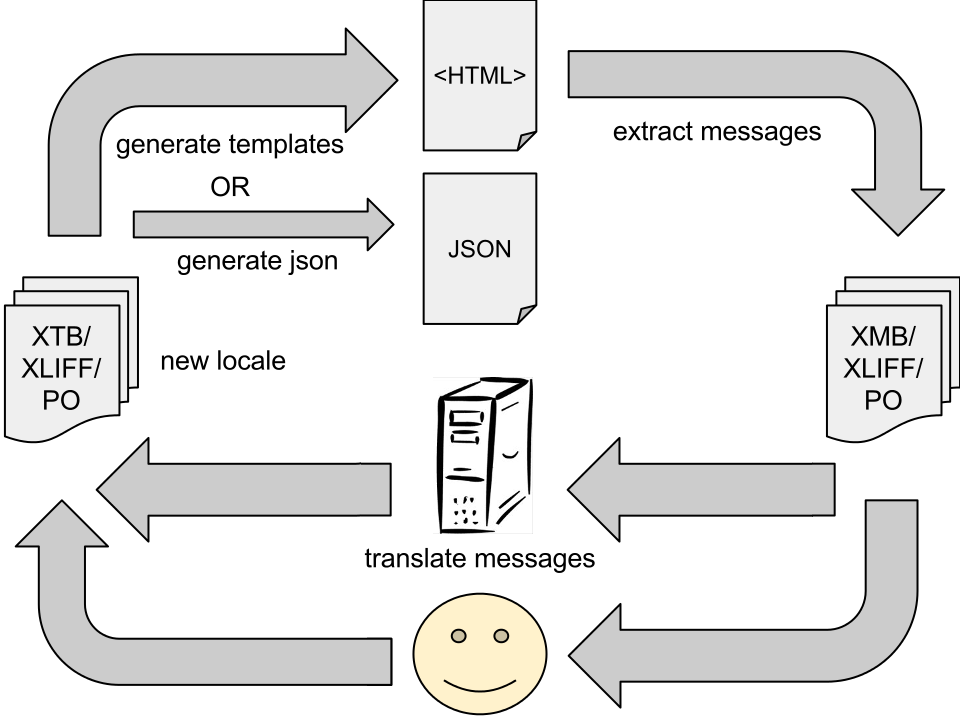

Internationalization, and Localization
======================================

<!-- START doctoc generated TOC please keep comment here to allow auto update -->
<!-- DON'T EDIT THIS SECTION, INSTEAD RE-RUN doctoc TO UPDATE -->

- [Internationalization, and Localization](#internationalization-and-localization)
  - [i18n Complexity](#i18n-complexity)
  - [i18n in Angular 1.x](#i18n-in-angular-1x)
    - [i18n Angular HTML Templates](#i18n-angular-html-templates)
  - [Internationalizing/Localizing an Existing Project](#internationalizinglocalizing-an-existing-project)
    - [Assets/Locales](#assetslocales)
    - [New Config Block](#new-config-block)
    - [Third Party Library Hooks](#third-party-library-hooks)
    - [Generating Gibberish For Testing](#generating-gibberish-for-testing)
    - [Language Selector Directive](#language-selector-directive)

<!-- END doctoc generated TOC please keep comment here to allow auto update -->

- i18n is short for internationalization.  The 18 represents the number of 
characters in the word "internationalization" that are between the first "i",
and the last "n"

- i18n is the process of designing, and building applications that facilitate
localization (l10n)

- l10n is short for localization.  The ten represents the middle characters
between the "l", and the "n"

- l10n is the cultural, and linguistic adaptation of an i18n application to two
or more culturally distinct markets


## i18n Complexity 

Internationalization can affect entire applications, and all project members
need to be aware of it on some level, from designers to engineers, to QA.
The process includes all of the following:

- Languages
- Number formats, date formats, time formats, eg 1,000.00 vs 1.000,00
- Currency
- Text direction (left to right, right to left...)
- Symbols, graphics, and more

Complexity of the internationalization process can vary from relatively simple,
to quite complex.  One example of a relatively simple case would be two
languages with similar character sets, and the same text orientation.  An
example of a complex case would be several different languages with different
text orientations, and different character sets.

Unfortunately, even relatively simple internationalization can sometimes
dramatically change application text, and layout.  

Consider the following:

    
    Language | Message | Text Length | Expansion
    ---------|---------|-------------|----------
    English  | Set the power switch to 0. | 26 chars | -
    French   | Placez l'interrupteur de tension à 0. | 37 chars | 42% more characters
    Spanish  | Ponga el interruptor de alimentación de corriente en 0.| 55 chars | 112% more characters


## i18n in Angular 1.x

Angular has attempted to support i18n/i10n in some form or another since the
early days.  In that time support has evolved.  The defacto standard, and soon
to be official standard for i18n support in Angular is 
[Angular Translate][ngTranslate] which is only compatible with Angular >= 1.4.x.  

Angular Translate has a few major features:

- Translation be done dynamically (no page reloads)
- Styles can be tested _while_ translators translate
- Supports complex ICU message formats
  
Angular translate's workflow looks like so:
  


In the workflow diagram the smiling face represents the translators.  There is
also a computer tower represented as a translator.  The best practice is to
have the development/design team work in their native language, _and_ a made
up "gibberish" language. 

This practice evolved out of the fact that _good_ translation takes time.
However, as was illustrated in the previous section, translations _will likely_
affect application layout.  The "gibberish" language can be generated as a
build step, and development/design can get near instant feedback on how
localization will affect the application.

### i18n Angular HTML Templates

Workflow begins, and ends with HTML, and JSON.  This HTML is _not_ quite the 
same as monolingual HTML.  There are a variety of reasons for this:

- Translators do not necessarily know Angular, or HTML
- Designers/Developers do not necessarily know the target languages
- Translators require _context_ in order to produce high quality translations

Before proceeding the angular-translate JavaScript will need to be added to
a project. This can be done through `npm`, `bower`, or through a [cdn][cdnAt]

Here is some HTML, and JS for a [simple Angular translate demo][demoBasic],
HTML:

```html

    <div ng-app="translateDemo">
      <h1>{{ 'TITLE' | translate }}</h1>
      <p>{{ 'BODY' | translate }}</p>
  
        <select ng-controller="DemoLang as lang"
                ng-model="lang.current"
                ng-change="lang.change(lang.current)">
        <option value='en'>English</option>
        <option value='fr'>French</option>
      </select>
    </div>

```

JS:

```js

    angular.module('translateDemo', ['pascalprecht.translate']).

    config(function($translateProvider) {

      // angular translate provides a number of mechanisms for preventing
      // a number of possible exploits
      $translateProvider.useSanitizeValueStrategy('sanitizeParameters');

      // angular translate will attempt to determine the user's preferred 
      // language by itself
      $translateProvider.determinePreferredLanguage(
          // a custom callback function could be provided here to do extra
          // language detection
      );
      
      // angular translate will likely get a language, *and* locale for example
      // 'fr_FR' or 'fr_CA' are specific French locales, and  'en_US', or 
      // 'en_GB' are specific English locales.  In many cases it is desirable to
      // simply use 'fr', or 'en'.  Angular translate make this possible:
      $translateProvider.registerAvailableLanguageKeys(['fr', 'en'], {
        'fr_ca': 'fr',
        'fr_fr': 'fr',
        'fr_ch': 'fr',
        'en_US': 'en',
        'en_GB': 'en',
        'en_CA': 'en'
      });
      
      // in a real application this data would come from the server, and/or be
      // packaged into the application as a build step
      $translateProvider.translations('en', { 
        TITLE: 'My Cool Demo',
        BODY: 'In English, and French'
      });

      // in a real application this data would come from the server, and/or be
      // packaged into the application as a build step
      $translateProvider.translations('fr', {
        TITLE: 'Ma Démo Fraîche',
        BODY: 'En anglais et en français'
      })
    }).

    controller('DemoLang', function($translate) {
      this.current = $translate.use();
      this.change = $translate.use;
    });
```

The above code requires a few extra JavaScript libraries to work, and is one of
the simplest possible translation examples available.  The above code works well
for very basic translations, but it does _not_ solve issues like pluralization,
or gender.

Pluralization, and gender have been translation problems for _years_.  
Consequently there are already existing tools that help with translation. 
Angular translate makes use of the [ICU Message Format][icu] which allows for
many translator friendly features that will help translators produce high
quality translations.

Compared to basic translations, working with Message Format requires _several_
more JavaScript dependencies:

- Message Format itself needs to be included ([cdn][cdnMf])
- Angular Translate ([cdn][cdnAt])
- Angular's Message Format wrapper ([cdn][cdnAmf])
- Angular Translate's Message Format Interpolater ([cdn][cdnAtimf])
- Message format locales for each used language

Angular translate provides even more advanced options though, 
[this gender demo][demoGender] which has HTML that looks like:

```html

    <div ng-app="translateDemo" ng-controller="DemoGender as gender">
      <h1>{{ 'TITLE' | translate }}</h1>
      <p>{{ 'P1' | translate }}</p>
      <p translate='P2'
         translate-values="{ GENDER: gender.current }"
         translate-interpolation="messageformat"></p>
      
        <select 
                ng-controller="DemoLang as lang"
                ng-model="lang.current"
                ng-change="lang.change(lang.current)">
          <option value='en'>English</option>
          <option value='fr'>French</option>
        </select>
      <select ng-model="gender.current">
        <option value='female'>Female</option>
        <option value='male'>Male</option>
        <option value='other'>Other
        </option>
      </select>
    </div>
```

The JavaScript looks like:

```js

        angular.module('translateDemo', ['pascalprecht.translate', 'ngMessageFormat']).
    
        config(function($translateProvider) {
    
          // angular translate provides a number of mechanisms for preventing
          // a number of possible exploits
          $translateProvider.useSanitizeValueStrategy('sanitizeParameters');
    
          // angular translate will attempt to determine the user's preferred 
          // language by itself
          $translateProvider.determinePreferredLanguage(
            // a custom callback function could be provided here to do extra
            // language detection
          );
    
          // angular translate will likely get a language, *and* locale for example
          // 'fr_FR' or 'fr_CA' are specific French locales, and  'en_US', or 
          // 'en_GB' are specific English locales.  In many cases it is desirable to
          // simply use 'fr', or 'en'.  Angular translate make this possible:
          $translateProvider.registerAvailableLanguageKeys(['fr', 'en'], {
            'fr_ca': 'fr',
            'fr_fr': 'fr',
            'fr_ch': 'fr',
            'en_US': 'en',
            'en_GB': 'en',
            'en_CA': 'en'
          });
          
          // message format follows ICU recommendations.  Unfortunately it 
          // has a *different* interpolation format than Angular.  By adding
          // interpolations, special message format interpolations can be used
          // as needed, while still allowing default Angular interpolations
          $translateProvider.addInterpolation('$translateMessageFormatInterpolation');
    
          // in a real application this data would come from the server, and/or be
          // packaged into the application as a build step
          $translateProvider.translations('en', {
            TITLE: 'My Cool Demo',
            P1: 'In English, and French',
            P2: '{GENDER, select, female{she is} male{he is} other {they are}} talented'
          });
    
          // in a real application this data would come from the server, and/or be
          // packaged into the application as a build step
          $translateProvider.translations('fr', {
            TITLE: 'Ma Démo Fraîche',
            P1: 'En anglais et en français',
            P2: '{GENDER, select, female{elle est} male{il est} other {ils sont}} talentueuse'
          })
        }).
    
        controller('DemoLang', function($translate) {
          this.current = $translate.use();
          this.change = $translate.use;
        }).
        
        controller('DemoGender', function () {
          this.current = 'female';
        });
```

There is not really _that_ much different between the ICU capable demo, and the
basic demo in terms of JavaScript. The differences are really in the way the
HTML messages are formatted.

### Custom Locale Filters

Even with all of these tools, sometimes it is necessary to create custom filters
for symbols, or constructs that Angular is not already aware of.

These can be done with custom filters.  Here is an example of a filter that
customizes how the percent symbo (%) is displayed depending on locale:

The JavaScript is a simple function that returns a filter function.  This
filter also takes a `givenLocale` value that _must_ be specified in HTML. This
is done to ensure that on any run time language change, the filter will update.

```js

  angular
    .module('workshop')
    .filter('percent', percentFilter);

  /** @ngInject */
  function percentFilter($translate) {

    function filter(input, givenLocale) {
      // givenLocale is optional on first run, but in HTML it needs to be
      // specified
      var locale = givenLocale || $translate.use();
      if (locale === 'fr') {
        return input + ' %';
      }
      return input + '%';
    }
    return filter;
  }
  
```

The HTML is below, and it is dependent on `$translate` being exposed on the
scope where the filter is used.

```html

    <li>{{ 55 | percent:$translate.use() }}</li>
```

### Large Bodies of HTML

Sometimes sites, and applications have large bodies of formatted text, like for
terms of service, or end user license agreements.  Rather than break such
documents down into messages, it is much easier to just pass in all the HTML.

This is actually easy to do with angular-translate, but there are a few
caveats.

- `angular-sanitize` needs to be included as a project dependency
- The sanitization strategy that angular-translute uses needs to be set. The
value `sanitizeParameters` works for unicode, and HTML.
- The translation needs to be placed on an `ng-bind-html` HTML attribute. 

Example:

Make sure the config block uses the `sanitizeParameters` strategy:

```js

    // Inside an angular.config
    // Tell the translation system how to sanitize HTML input
    $translateProvider.useSanitizeValueStrategy('sanitizeParameters');
```

The HTML that imports a large block of HTML would look like so:

```html

    <li ng-bind-html="'WITH_HTML' | translate"></li>
```

In the above example `'WITH_HTML'` is a tag in a translation's JSON file, that
tag should be a block of HTML.


## Internationalizing/Localizing an Existing Project

This process will assume that there is currently little to no i18n, or l10n
implemented in a given project.

Existing projects that are _not_ internationalized will likely have _many_
messages embedded directly in HTML.  For both simple, and complex translation
cases those texts are going to migrate into JSON files.

These JSON files should ideally be stored under a common "locales" directory,
and they should be labelled `locale-{{locale}}.json`.  For example, French
Canadian would be `locale-fr_CA.json`, and English would be
`locale-en_CA.json`.

These locale JSON files can be extremely simple, with a unique attribute for
each message, or name-spaced by feature.  This document will assume that 
local JSON's are name-spaced by feature.

Localized JSON files will also need to be built into the project so that they
can be used.  There is a gulp plugin for this, `gulp-angular-translate`.

In order to better explain this workflow, there is a [project][projectPre] that
is converted into an [i18n project][projectSimple]

In order to translate the sample project:

- a `locales` directory is added under `src/assets`
- Every HTML partial in the project with translatable language has that
language replaced with a `{{ KEY | translate }}` expression, where `KEY` is a
unique identifier.  The original text is placed in a JSON file using the `KEY`
attribute.
- Any angular-i18n JavaScript localization rules need to be included in the 
`locales` directory
- the application's modules need to be updated to include angular-translate
('pascalprecht.translate') and angular-dynamic-locale ('tmh.dynamicLocale')
- a new config block is added to `src/app/index.config.js`
- angular-dynamic-locale needs to be plugged into angular-translate's events
- any third party libraries need to be plugged into angular-translate's events
so that they can be informed of the change
- (optional) generate gibberish language for testing
- (optional) language selector directive


This results of this process, including generating gibberish, and real time
language selection can bee seen in [this sample project][projectSimple]

### Assets/Locales

When the text in HTML partials is extracted, it is placed in JSON files in this
folder.  Strictly speaking this folder could be named anything so long as the
angular translate package is informed.

Each JSON file in this folder _should_ be named in the format: 
`locale-{{locale}}.json`, although the angular-translate package will allow
for a variety of manual overrides.

Additionally any angular localization rules (angular-i18n) need to be added to 
this directory so that angular-dynamic-locale can fetch them as needed.

### Adding The Translation, and Locale Modules

The modules are in the project's main `index.module.js` modules array, and
look like so:

```js

    angular
    .module('workshop', [
      // Angular Translate
      'pascalprecht.translate',
      // Dynamic Locales
      'tmh.dynamicLocale',
      // not literally ... there are other modules omitted for brevity
      ...]);
```

### New Config Block

The new config block works just like the config blocks in the CodePen examples.
In the workshop project the config block is added to `index.config.js`, and the
config function looks like:

```js

  /** @ngInject */
  function translations($translateProvider, tmhDynamicLocaleProvider) {
    // Tell the translation system how to sanitize HTML input
    $translateProvider.useSanitizeValueStrategy('sanitizeParameters');

    // Configure the locale loader
    tmhDynamicLocaleProvider.localeLocationPattern(
      '/assets/locales/angular-locale_{{locale}}.js');

    // Configure the translation loader
    $translateProvider.useStaticFilesLoader({
      prefix: 'assets/locales/locale-',
      suffix: '.json'
    });

    // Determine the browser's preferred language
    $translateProvider.determinePreferredLanguage();

    // Optionally use generic translations as opposed to localized translations
    $translateProvider.registerAvailableLanguageKeys(['fr', 'en'], {
      'fr_ca': 'fr',
      'fr_fr': 'fr',
      'fr_ch': 'fr',
      'en_US': 'en',
      'en_GB': 'en',
      'en_CA': 'en'
    });
  }
```

### Dynamic Locale Library Hook

In order for locales to switch dynamically in Angular, a library called
`angular-dynamic-locale` is used.  This library has a _service_ called
`tmhDynamicLocale` which needs to have its `set` method called when locale
changes start.

This will update all of Angular's internally localized systems, like the
currency, and date filters.


```js

  /** @ngInject */
  function runBlock($log, $rootScope, tmhDynamicLocale) {

    $rootScope.$on('$translateChangeStart', function (event, locale) {
      // when the translation change starts let the dynamic locale system know
      tmhDynamicLocale.set(locale.language).then(function ( ) {
        $log.log('changed', locale);
      }, function (err){
        $log.log(err.message);
      });
    });
  }
```


### Third Party Library Hooks

The workshop project has an external library called "moment" that is responsible
for date manipulation.  Dates are highly localized, and the moment library is so
advanced that it even creates date range strings like "3 days ago".  These
strings clearly need to be translated.

Fortunately moment has great i18n support, and angular translate has events. In
the workshop project `index.run.js` is modified to look like so:

This listener can either be setup in its own run block, or configured in the
same run block as the dynamic locale listener.  For brevity the same run block
is used in this example.

```js

  /** @ngInject */
  function runBlock($log, $rootScope, tmhDynamicLocale,moment) {

    $log.debug('runBlock end');
    $rootScope.$on('$translateChangeStart', function (event, locale) {
      tmhDynamicLocale.set(locale.language).then(function ( ) {
        $log.log('changed', locale);
      }, function (err){
        $log.log(err.message);
      });
      moment.locale(locale.language);
    });
  }

```


### Generating Gibberish For Testing

If an application is being translated for the first time, there is a good chance
the translators do not work on site, and will not receive the text right away.
Due to the nature of the translation workflow the code has already been prepared
for translation at this point.

Instead of waiting to get a translation back, only to find out that it breaks
existing styles, developers can use a package called 
"pseudo-translate-angular-json", which has a gulp version
"gulp-pseudo-translate-angular-json".  To get this working with the workshop
project a new file `pseudo-translate.js` is added to the gulp folder.  This file
looks like:

```js

var gulp = require('gulp');
var pseudoTranslator = require('gulp-pseudo-translate-angular-json');
var jeditor = require('gulp-json-editor');
var rename = require('gulp-rename');

gulp.task('i18n:pseudo', function() {
  gulp.src('src/assets/locales/locale-en.json') // url to source file
    .pipe(jeditor(function(json) {
      return pseudoTranslator(json, {increasePercent: 50});
    }))
    .pipe(rename('locale-gb.json')) // destination file name
    .pipe(gulp.dest('src/assets/locales/')); // destination folder
});

```

This gulp task generates a translation, and names it `locale-gb` which is a
completely fabricated locale.  The upside of using a completely fabricated
locale is that it will not conflict with any existing languages.  The downside
is that it won't work with third party libraries, and it needs to be removed.


### Language Selector Directive

Angular translate can change languages in real time. In most cases the user
should be the one changing languages, and for that to happen they will need
some sort of control.

For the workshop a simple select drop down is used.  For this a new component
is added to the workshop project.  It has HTML that looks like:

```html


<nav class="locale-selector">
  <select ng-model="vm.current" ng-change="vm.change(vm.current)">
    <option value="en">{{ 'Locale.EN' | translate }}</option>
    <option value="gb">{{ 'Locale.GB' | translate }}</option>
  </select>
</nav>

```

There is also a corresponding directive that looks like:

```js

  angular
    .module('workshop')
    .directive('localeSelector', localeSelector);

  /** @ngInject */
  function localeSelector() {
    var directive = {
      restrict: 'E',
      templateUrl: 'app/components/localeSelector/localeSelector.html',
      scope: {
          creationDate: '='
      },
      controller: LocaleSelectorController,
      controllerAs: 'vm',
      bindToController: true
    };

    return directive;

    /** @ngInject */
    function LocaleSelectorController($translate) {
      var vm = this;

      vm.current = $translate.use();
      vm.change = $translate.use.bind($translate);
    }
  }
  
```

This directive creates a translated list of languages, and when the drop down
changes, the `$translate` service changes locales.


[projectSimple]:./workshop-post-translate-simple "Project After Simple Translations"
[projectPre]:./workshop-pre-translate "Project Before Translation"
[cdnAtimf]:https://cdnjs.cloudflare.com/ajax/libs/angular-translate-interpolation-messageformat/2.8.1/angular-translate-interpolation-messageformat.js "Angular Translate Interpolation Message Format CDN"
[cdnAmf]:https://cdnjs.cloudflare.com/ajax/libs/angular.js/1.4.8/angular-message-format.js "Angular Message Format Wrapper CDN"
[cdnMf]:https:https://cdn.rawgit.com/SlexAxton/messageformat.js/0.2.2/messageformat.js "Message Format CDN"
[cdnAt]:https://cdnjs.cloudflare.com/ajax/libs/angular-translate/2.8.1/angular-translate.js "Angular Translate CDN"
[icu]:http://site.icu-project.org/ "International Components For Unicode"
[demoGender]:http://codepen.io/bennett000/pen/OyevPL "Gender based example"
[demoBasic]:http://codepen.io/bennett000/pen/PPrEve/ "Simple English/French Angular Translate Example"
[ngTranslate]:https://github.com/angular-translate/angular-translate "Angular Translate Module"
