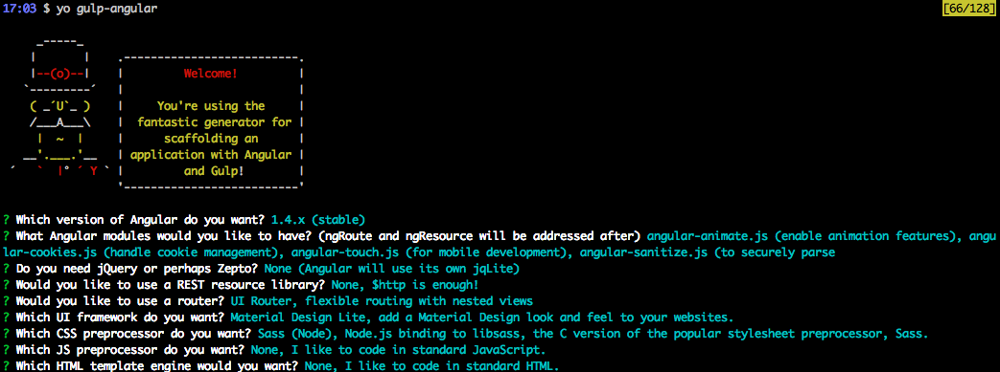
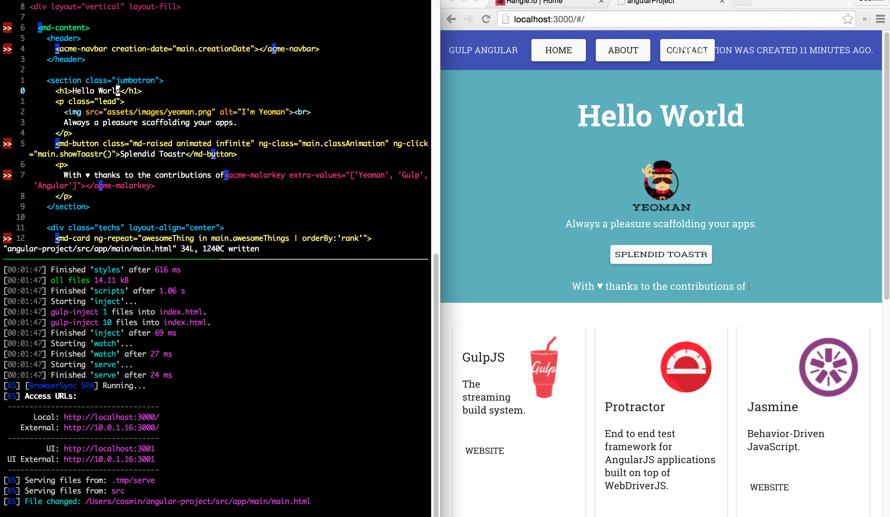
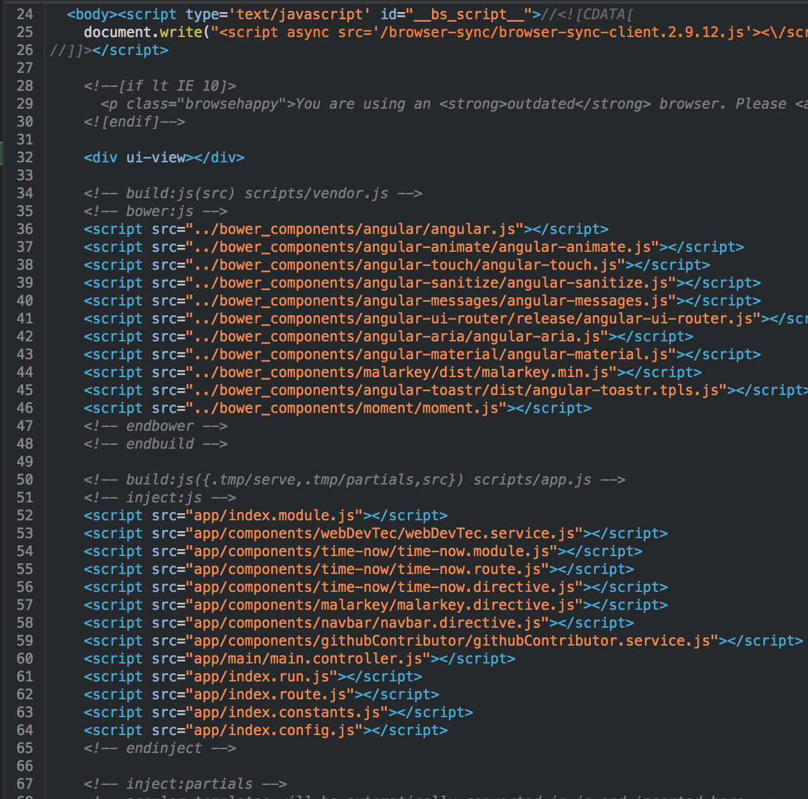
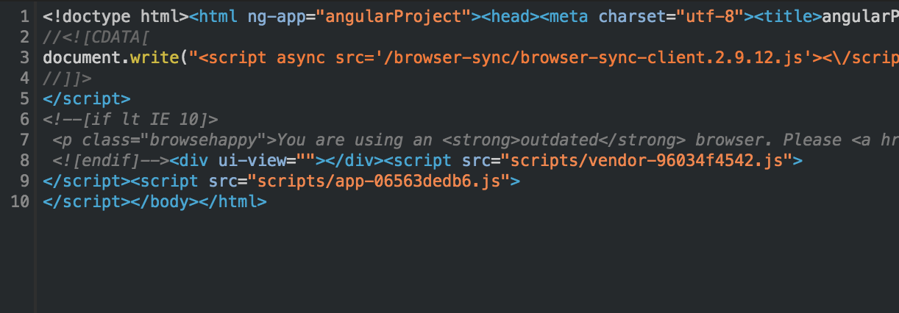
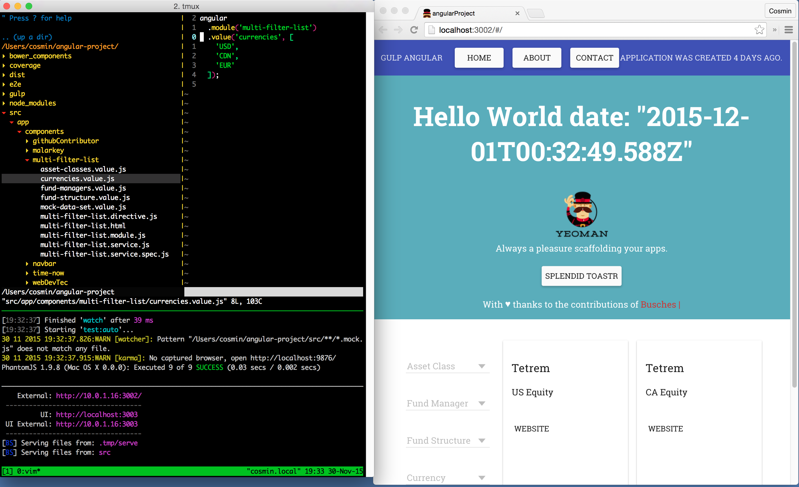
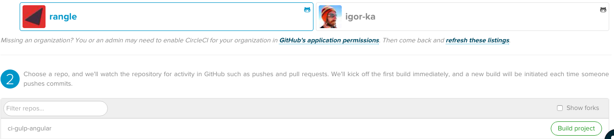
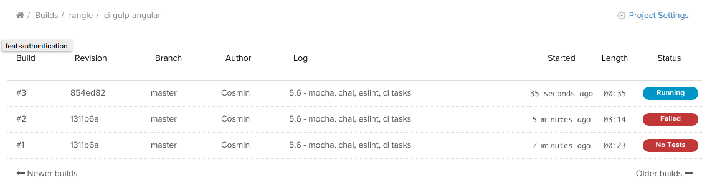
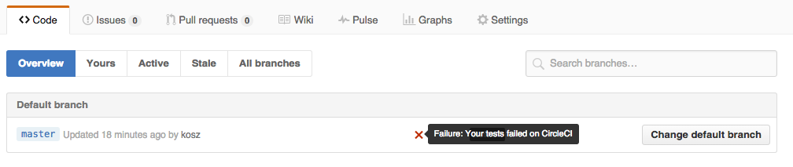
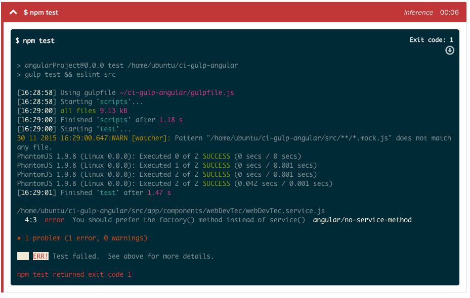

## 1. Project Ecosystem

Having a well designed ecosystem for a project from the start will be quite beneficial in the long run. A holistic ecosystem would include guidelines, a well thought of directory and code structure, build and development automation, testing and test coverage concerns, as well as the right tools for the job.

In this section we will focus on increasing our understanding of what is currently available and accepted enabling us to make the right decisions for our specific set of needs.  

### 2. What to expect after working through this document

- a good understanding of the history, the current state, and the future of javascript front end development environments
- information and references to various angular best practices
- a list of focused references and cheatsheets to further smoothen the learning curve
- the ability to kick start a new angular project (skeleton) with a solid development environment within minutes
- understanding how to use the development environment and information on how to learn more about it's internals
- guided exercises on how to develop new features and components on the code base
- *note* throughout the code examples, there will be slight syntactical inconsistencies. This is done on purpose, to illustrate the multiple approaches. Ultimately the team can chose their own syntax preferences.

### Table of Contents

1. [Project Ecosystem](#1-project-ecosystem)
1. [What to expect](#2-what-to-expect-after-working-through-this-document)
1. [Past, Present and Future](#3-past-present-and-future)
 1. [Gen 1: Past](#gen-1--2012-1013-)
 1. [Gen 2: Present](#gen-2--2014-2015-)
 1. [Gen 3: Future](#gen-3--2015-)
 1. [Historical Summary](#historical-summary)
4. [Common tools at the start of 2015](#4-common-tools-at-the-start-of-2015)
 1. [nodejs](#nodejs)
 1. [npm](#npm)
 1. [nvm](#nvm)
 1. [gulp](#gulp)
 1. [bower](#bower)
 1. [karma](#karma)
 1. [Other Tools](#other-tools)
5. [Project File Structure Considerations](#5-project-file-structure-considerations)
6. [Application Directory Structure Considerations](#6-application-directory-structure-considerations)
7. [Smoothening the learning curve](#7-smoothening-the-learning-curve)
 1. [Defusing stigma around yeoman generators](#defusing-stigma-around-yeoman-generators)
 1. [Generating a codebase from scratch with the gulp-angular yeoman generator](#generating-a-codebase-from-scratch-with-the-gulp-angular-yeoman-generator)
8. [Working with the gulp-angular generated scaffolding](#8-working-with-the-gulp-angular-generated-scaffolding)
  1. [Hello World & Live Reload](#hello-world-live-reload)
  1. [Adding a module](#adding-a-module)
  1. [Modular Routes](#modular-routes)
  1. [Running a production build](#running-a-production-build)
  1. [Adding Linting](#adding-linting)
  1. [Understanding the Gulp configuration](#understanding-the-gulp-configuration)
  1. [Changing to Mocha and Chai for testing](#changing-to-mocha-and-chai-for-testing)
  1. [Tightening the feedback loop](#tightening-the-feedback-loop)
  1. [Adding Circle CI](#adding-circle-ci)
9. [Other Considerations](#9-other-considerations)
  1. [Keeping thin controllers](#keeping-thin-controllers)
  1. [Don't forget the angular 1.5 component](#dont-forget-the-angular-15-component)
  1. [Service vs Factory](#service-vs-factory)
    1. [Advanced usage for factories](#advanced-usage-for-factories)
  1. [Use app specific prefixes for directives and services](#use-app-specific-prefixes-for-directives-and-services)
  1. [Service Types](#service-types)
  1. [Aim for single concern functions](#aim-for-single-concern-functions)
  1. [Consider using own observer pattern implementation](#consider-using-own-observer-pattern-implementation)
10. [Conclusion](#10-conclusion)

### 3. Past, Present and Future

#### Gen 1 ( 2012-1013 )
With a rise in popularity of asyncronous front end apps and node.js, various automation tools started emerging which would address common concerns of front end javascript development, such as package management ( provided initially by Bower ), scaffolding generation ( provided initially by Yeoman ), task automation ( provided initially by Grunt ).

#### Gen 2 ( 2014-2015 )
After a few years of using these tools, a first shift happened, towards new buzzword tools which improved upon the lessons learned by the previous generation of tools. Gulp replaced Grunt due to it's code over configuration approach and improved async code, Slush replaced Yeoman by removing unecessary abstractions and allowing the scaffolding automation to leverage gulp and it's ecosystem, while Bower continued to require an overly complex configuration to counteract es5's inability to work with modules, requirement which the gulp ecosystem handled successfully however not ideally due to the amount of configuration, plugins and understanding needed to achieve a mature setup.

#### Gen 3 ( 2015+ )
At this point in time however, we are experiencing a second/new major shift of best practices and tools, towards an ecosystem which embraces the unavoidable fact, that from now on we will not be coding in the same language supported by the browser, but instead, we will leverage the power of pre-processor languages such as TypeScript or Babel's ES6 implementation, which have the ability to evolve a lot faster, while maintaining backwards compatibility with the older browsers ( which is always a major concern ), through transpilation or precompilation into the browser's current support flavor of the ES(EcmaScript=JavaScript) language. Within this new generation, tools such as webpack and jspm have started replacing even gulp, by adressing the usual concerns learned by the previous generations, in a more elegant and simplistic manner, improving development experience. Also due to the new es6 module loader available to this new generation of tools, Bower development has officially stopped 2 weeks ago, as the tool is getting ready for it's imminent deprecation.

#### Historical Summary

    Generation | Task Runner | Automation | Package Manager | Languages| Angular |
    -----------|-------------|------------|-----------------|----------|-----------------|
    Gen 1 2012-1013  | grunt |  grunt plugins | bower | JS/ES5/CoffeeScript | <1.3
    Gen 2 2014-1015  | gulp |  gulp plugins | bower | JS/ES5  | >1.3
    Gen 3 2015+  | npm |  webpack | npm | Babel ES6/TypeScript | >1.3 & 2.0

### 4. Common Tools at the start of 2015

In order to ensure the most stable and mature ecosystem for an Angular 1.4 production app, we may chose to look at older, more mature tools which have already been used in production for "years". A well thought off combination would include a big part of what we labeled Gen 2 tools, with some Gen 1 tools, and maybe a splash of Gen 3 as possible.  

The following set of tools are often found in mature Angular 1.4 environments:

#### node.js

While not directly used in the actual app ( in a Gen 2 app ), most other tools found in a Angular's app ecosystem ( such as gulp, bower, etc) require [node.js](nodejs.org) to run.

#### npm

The [Node Package Manager](www.npmjs.com). Once again, not needed for the actual Gen 2 app, however used to install all node.js tools.

##### npm cheatsheet

- `npm i package-name another-package -g` installs one or more packages globally. Example: `npm install gulp karma -g`
- `npm i package-name another-package --save-dev` installs one or more packages, and adds them as dev dependencies to package.json
- `npm i package-name another-package --save` installs one or more packages, and adds them as production dependencies to package.json
- `npm install` installs all dev and production dependencies specified in package.json. The install will create a new directory `node_modules` and drop all the dependencies there. This directory may need to be purged at times during heavier updates, and can be regenerated witn `npm install`

#### nvm

The [Node Version Manager](https://github.com/creationix/nvm). A best practice tool, which allows running and configuring different node environments on the same system. Really useful for staying up to date with the latest stable plugins, as it allows testing updates with ease.

##### nvm cheatsheet

- `nvm list` shows a list of all available node versions.
- `nvm install 5` installs the latest node 5 version, other examples `nvm install 0.12`, `nvm install 4`
- `nvm use 5` uses the latest installed version 5, if available
- `nvm alias default 5` set the latest installed version 5 as default, if available.
- *tricky bit*: each nvm installation will have it's own globally installed node_modules, so as an example if gulp is installed on node 4, and node 5 is installed, gulp will need to be reinstalled globally ( `npm install gulp -g` ), after a `nvm use 5` change to node 5 on the system.

#### gulp

A [task runner](http://gulpjs.com/) with it's own [immense ecosystem of plugins](http://gulpjs.com/plugins/) and compatible libraries, which can be wired up into a robust development and deployment automation system.

##### basic anatomy of a gulp task

```js
gulp.task('taskName', [ 'dependencyTask', 'otherDependencyTask' ], function() {
  return gulp.src('path/to/yourfiles')
    .pipe(gulpPluginCall())
    .pipe(anotherGulpPluginCall());
});
```

In order to write a gulp task, the gulp.task javascript function is invoked with 3 parameters:
1) the name of the task
2) array containing names of other tasks that should be fired before and this task will only execute after they finish
3) a function programming what the task will do

While there are other details to gulp, this explanation aims to provide a solid basic understanding.

#### bower

The [JavaScript package manager for the Web](http://bower.io/). Basically like npm, but for web packages such as angular. There are many tools within the gulp ecosystem which automate adding and removing references in index.html from the Bower packages. Normally Bower components will sit in a directory called `bower_components` unless otherwise specified in `.bowerrc` config file

##### bower cheatsheet

Basically `bower install` using the same format and flags ( `--save`, `--save-dev` ) as npm, except the global flag. Examples `bower install angular angular-translate --save`. The saved packages will be added to bower.json, which is where bower keeps config information about the project and a list of it's installed dependencies. This file is rather important for automation, as gulp plugins tend to use it, to know which files to bundle up and reference automatically in the project.

#### karma

A [JavaScript test runner](http://karma-runner.github.io/0.13/index.html).

##### karma cheatsheet

- `karma init` runs a script which creates a karma.conf.js file for the project
- `karma start karma.conf.js` starts karma, using karma.conf.js as the config file. If the file is named karma.conf.js the command `karma start` should also work and automatically use the karma.conf.js file.
- [more docs on this](http://karma-runner.github.io/0.13/intro/configuration.html)
- [karma config file docs](http://karma-runner.github.io/0.13/intro/configuration.html)

#### sass

A [preprocessor language](http://sass-lang.com/) which adds features and compiles, to CSS.

#### Other Tools

A lot of smaller tools are found within such an ecosystem, such as wiredep, gulp-inject, gulp-minify-css, mocha, chai, and tons of others. Even though their number can feel overwhelming, most of them are simple to grasp. The complexity lies within knowing which to use for the right job, and hopefully the next section will help a lot smoothen this learning curve.

### 5. Project File Structure Considerations

Normally an Angular Project will consist of a directory structure which looks similar to this.

```
.
├── .gitignore
├── .tmp
│   └── index.html
├── bower.json
├── bower_components
├── dist
│   ├── bundle.css
│   ├── bundle.js
│   └── index.html
├── index.html
├── karma.conf.js
├── node_compoennts
├── package.json
└── src
```

While some of these files and directories were explained in sections above, the most notable thing in this example is the 3 index.html's. There is a base level index.html, which will always stay pristine with no imports, a .tmp/index.html which will be served in development mode and will contain the individual imports injected automatically by gulp+bower&friends, and a dist/index.html which will be served in production and contain the injected imports of bundled, minified and uglified, production ready source files. All this automation will be handled by the gulp ecosystem. ( more on that [later]() ).

Also to be noted that this directory structure is for a Front end Project *only*. It is generally considered best practice to isolate the
front end project from the API backend project. Basically this project could be something like `github.com/rangle/todoapp-front-end` and have a matching `github/rangle/todoapp-back-end` written in a completely different language and environment other than JavaScript. This tends to complicate work for QA Automation and Dev Ops, but ultimately it makes everything more holistic, and allows taking advantage of a modern front end project's environment.

### 6. Application Directory Structure Considerations

The application source code will normally be isolated in the `src` directory, other times also named `app` or `www`.

Inside here, the Angular community has adopted the first official implementation of a feature based directory structure. That is, instead of separating different types of files in different directories:

```
.
└── src
    ├── controllers
    │   └── todoCtrl.js
    ├── directives
    │   └── todoDirective.js
    ├── services
    │   └── todoService.js
    ├── styles
    │   └── todo.scss
    ├── templates
    │   └── todo.html
    └── tests
        └── todoTest.js
```

The community chose to drop all files related to a single feature/component within the same directory, thus making the directory structure a bit easier to surf, with the benefit of having to work in a single directory when focusing on a component with multiple files.

```
.
└── src
    ├── components
    │   └── todo
    │       ├── todo.controller.js
    │       ├── todo.directive.js
    │       ├── todo.html
    │       ├── todo.scss
    │       ├── todo.service.js
    │       └── todo.spec.js
    └── shared
        └── rest-service
            └── rest.service.js
```

There are a lot of small variations of how these structures and naming conventions are implemented, and the best approach is to understand the general consensus, then based on that, decide on a custom set of conventions, which best fit the requirements of the project. In fact the purpose of this document is not to present a one size fits all solution, instead, to enable the team to understand the information available and make the best decisions.

Having said that however, based on this very popular page titled [An AngularJS Style Guide and Best Practice for App Structure](http://angularjs.blogspot.ca/2014/02/an-angularjs-style-guide-and-best.html), the latest, most accepted recommendations can be found in John Papa and Todd Motto's [angular-styleguide](https://github.com/johnpapa/angular-styleguide), a document which itself can provide a lot of insight into Angular best practices, as well as serve as a source for best practice updates, since it's contributors strive to keep it up to date with the latest ideas.

### 7. Smoothening the learning curve

As previously stated, while the automation features in the Gen 2 gulp based ecosystems have grown in number, the complexity also grew, and a mature development environment setup requires the use of a lot of plugins which can take weeks to setup properly from scratch.

In order to deal with this issue, we can employ the use of seeds, generators and any types of examples we can find. There is a lot of boiler plate configuration code required here. And the node community chose to deal with this problem initially by employing the same solution the rails framework initially presented. The [yeoman]() generator and later the [slush]() generator provided quick ways for the community to build generator plugins with the ability to scaffold an entire app codebase from scratch, with all the automation goodies preconfigured.

#### Defusing stigma around yeoman generators

Yeoman really took off in 2013 and at the time, the yeoman team wrote a generator called `generator-angular` meant to scaffold a basic angular app. This generator also grew in popularity around the same time that the new angular best practices grew, such as using controllerAs, feature based directories and gulp automation. Because of this fact a lot of people started perceiving yeoman as a tool for outdated practices.

However since, a number of new generators grew in popularity, and the [gulp-angular]() generator just happens to currently provide scaffolding following a lot of the best practices and with a great set of features. The scaffolding provided by gulp-angular can enable a very quick start to a project, and then the scaffolded code can further be customized as per requirements.

Another consideration here, that technically speaking, with the emergence of slush and the new generation of technologies, yeoman, just like bower, is practically an obsolete tool, however, it still has great value when used as a learning tool, to access configuration examples.

#### Generating a codebase from scratch with the gulp-angular yeoman generator

Install yeoman and generator-gulp-angular globally:

```
npm i yo generator-gulp-angular -g
```

Create a directory for the new project:

```
mkdir angular-project
```

Run the angular generator and customize the scaffolding based on it's questions.

```
yo gulp-angular
```



Once the generator has finished, the project scaffolding is ready. The `angular-project` can now be opened in an editor/IDE and the server can be fired up by running:

```
gulp serve
```

this should automatically open up a browser window displaying the new app.

> **Warning**: when cloning an Gen 2 angular project, it is normally required to run `npm install && bower install` so that the required vendor packages are available. If they are not available the application will not work.

It can be noticed that while the directory structure doesn't follow the best practices 100%, it does come really close to them. The directory structure should already look familiar:

```
.
├── bower.json
├── e2e
│   ├── main.po.js
│   └── main.spec.js
├── gulp
│   ├── build.js
│   ├── conf.js
│   ├── e2e-tests.js
│   ├── inject.js
│   ├── scripts.js
│   ├── server.js
│   ├── styles.js
│   ├── unit-tests.js
│   └── watch.js
├── gulpfile.js
├── karma.conf.js
├── package.json
├── protractor.conf.js
└── src
    ├── app
    │   ├── components
    │   │   └── navbar
    │   │       ├── navbar.directive.js
    │   │       ├── navbar.directive.spec.js
    │   │       ├── navbar.html
    │   │       └── navbar.scss
    │   ├── index.config.js
    │   ├── index.constants.js
    │   ├── index.module.js
    │   ├── index.route.js
    │   ├── index.run.js
    │   ├── index.scss
    │   └── main
    │       ├── main.controller.js
    │       ├── main.controller.spec.js
    │       └── main.html
    ├── assets
    │   └── images
    │       └── yeoman.png
    ├── favicon.ico
    └── index.html
```

### 8. Working with the gulp-angular generated scaffolding

A copy of a generated project, with all the code in this section separated throughout various commits, is available at:

https://github.com/rangle/ci-gulp-angular

The commit log will tell the story:

https://github.com/rangle/ci-gulp-angular/commits/master

#### Hello world & Live Reload

Let's start out simple. Assuming that `gulp serve` is running, the text `Allo' Allo'` should be visible on the page. Let's change this to `Hello World`. The text can be found in the `src/app/main/main.html`.

You may notice that as the file is saved, the browser automatically reloads the page. This is because `gulp serve` is the development mode of the server, and it provides live reload, which reloads the page automatically after every single file change. This can be a powerful productivity tool when the browser and editor are both visible at the same time.


- [Demo Video](http://quick.as/l8ygfxajv)
- [Commit Diff](https://github.com/rangle/ci-gulp-angular/commit/7efcedd61bf8078df4b21fdee2b7c71842ad5f46)
- Checking out this version of the commit from the project's root: `git checkout 7efcedd61bf8078df4b21fdee2b7c71842ad5f46`

#### Adding a module

The scaffolded app is initially a single module app. In the previous lesson we mentioned the benefits of splitting the app into multiple modules. The code base can be easily adapted to include more modules in the app.

Let's create a new module called timeNow, which contains a directive that renders into the current date and time and updates every time it's clicked.

- [Commit Diff](https://github.com/rangle/ci-gulp-angular/commit/739fd3bd8e8fe06793b0cadaf8b79d08388a29e4?diff=unified)
- Checking out this version of the commit from the project's root: `git checkout 739fd3bd8e8fe06793b0cadaf8b79d08388a29`

#### Modular Routes

While the traditional approach at writing an app's routing config is to dump all routing information in a single file, in larger apps, it may be beneficial to modularize the routes, but adding route config within each component/controller which could be used as a route.

Let's write such a config for the time-now component, thus making it available to our app as both an Angular Directive, AND a UI Route available at localhost:3000/#/time-now

- [Commit Diff](https://github.com/rangle/ci-gulp-angular/commit/d3e1303cbe97c5dae1d055eeb9c2716e5e16d204)
- Checking out this version of the commit from the project's root: `git checkout d3e1303cbe97c5dae1d055eeb9c2716e5e16d204`

#### Running a production build

TLDR;

```
gulp serve:dist
```

In order to optimize a front end web app, it's considered a good practice to minify and uglify your code in production, this way if the app consists of some 300 files, the browser does not load 300 files, instead, it loads a single file, which consists of the 300 files concatenated, minified, uglified to ensure that the load time is kept as small as possible.

Setting this up can be confusing, error prone and tedious, luckily, the scaffolding which we generated already has the right automation scripts to handle this. In order to preview a production build of the app, one can simply stop the `gulp serve` task, and instead run the `gulp serve:dist` task. This task will package the app automatically into a dist folder, and serve that. That dist folder can also be deployed in production.

> **Warning**: At times there are discrepancies between what `gulp serve` and `gulp serve:dist` show. In our case, there is ONE single semicolon missing, and this causes `gulp serve:dist` to not work at all, while `gulp serve` is working just fine. We'll fix this for now in a commit and discuss it further in the next section.

- [Commit Diff](https://github.com/rangle/ci-gulp-angular/commit/470ee5e2cb9f8f970c96a98f73e0b9bcbac0b70f)
- Checking out this version of the commit from the project's root: `git checkout 470ee5e2cb9f8f970c96a98f73e0b9bcbac0b70f`

#### Adding Linting

The production build error which we've just experienced could seriously ruin our day ( or night ) if it's not prevented. A single missing semicolon broke the entire production build.

Adding a Linter to your development will go a long way towards preventing such issues. The linter will parse your code and advise on errors.

While the old generation of linters, JSHint and JSLint are on their way out, today ESLint and TSLint are growing in popularity. Setting up ESLint is simple, we need to install it globally:

```
npm install eslint -g
```

The scaffolding already has a (very minimal) .eslintrc configuration file included, but we'll use this for now to run eslint. Since the .eslintrc specifies an eslint angular plugin we'll have to globally install that as well

```
npm install eslint-plugin-angular -g
```

at this point we can run `eslint src` to parse all the js files in the project's `src` folder.

```
eslint src
```

> *Note:* The default .eslintrc is quite basic and does not really cover a significant potion of what linting should be checking for. It is up to the team to determine the linting rules in order to ensure code quality meets their standards. Common linting rules include: spacing preferences, syntax considerations, feature restrictions ( such as disallowing console.log or eval in production ). The full set of eslint rule options can be found at: http://eslint.org/docs/rules/, and the ones for the angular plugin at https://github.com/Gillespie59/eslint-plugin-angular#rules

#### Understanding the Gulp configuration

Gulp is used to configure the project's automation. A group of javascript files declare gulp tasks, which work together to provide the needed automation.

When running `gulp`, the gulp CLI will look for declared tasks in a `gulpfile.js` inside the current directory.

In the generated project, the gulpfile.js loads a set of javascript files from the gulp directory. Each of these files declares tasks addressing specific concerns.

```
gulp
├── watch.js
├── unit-tests.js
├── styles.js
├── server.js
├── scripts.js
├── inject.js
├── e2e-tests.js
├── conf.js
└── build.js
gulpfile.js
```

Right after the project was generated the yeoman generator printed docs on the gulp task interface:

```
It's time to use Gulp tasks:
- `$ gulp` to build an optimized version of your application in folder dist
- `$ gulp serve` to start BrowserSync server on your source files with live reload
- `$ gulp serve:dist` to start BrowserSync server on your optimized application without live reload
- `$ gulp test` to run your unit tests with Karma
- `$ gulp test:auto` to run your unit tests with Karma in watch mode
- `$ gulp protractor` to launch your e2e tests with Protractor
- `$ gulp protractor:dist` to launch your e2e tests with Protractor on the dist files
```

These task sequences can be read and modified inside the gulp tasks directory. For example if we wanted to see how `gulp` works, which runs a `build` by default, we could read the `html` task from the `gulp/build.js` file:

```
gulp.task('html', ['inject', 'partials'], function () {
  var partialsInjectFile = gulp.src(path.join(conf.paths.tmp, '/partials/templateCacheHtml.js'), { read: false });
  var partialsInjectOptions = {
    starttag: '<!-- inject:partials -->',
    ignorePath: path.join(conf.paths.tmp, '/partials'),
    addRootSlash: false
  };

  var htmlFilter = $.filter('*.html', { restore: true });
  var jsFilter = $.filter('**/*.js', { restore: true });
  var cssFilter = $.filter('**/*.css', { restore: true });
  var assets;

  return gulp.src(path.join(conf.paths.tmp, '/serve/*.html'))
    .pipe($.inject(partialsInjectFile, partialsInjectOptions))
    .pipe(assets = $.useref.assets())
    .pipe($.rev())
    .pipe(jsFilter)
    .pipe($.sourcemaps.init())
    .pipe($.ngAnnotate())
    .pipe($.uglify({ preserveComments: $.uglifySaveLicense })).on('error', conf.errorHandler('Uglify'))
    .pipe($.sourcemaps.write('maps'))
    .pipe(jsFilter.restore)
    .pipe(cssFilter)
    .pipe($.sourcemaps.init())
    .pipe($.replace('../../bower_components/material-design-iconfont/iconfont/', '../fonts/'))
    .pipe($.minifyCss({ processImport: false }))
    .pipe($.sourcemaps.write('maps'))
    .pipe(cssFilter.restore)
    .pipe(assets.restore())
    .pipe($.useref())
    .pipe($.revReplace())
    .pipe(htmlFilter)
    .pipe($.minifyHtml({
      empty: true,
      spare: true,
      quotes: true,
      conditionals: true
    }))
    .pipe(htmlFilter.restore)
    .pipe(gulp.dest(path.join(conf.paths.dist, '/')))
    .pipe($.size({ title: path.join(conf.paths.dist, '/'), showFiles: true }));
  });
```

This is a pretty big task which ensures that the app is fully optimized for production mode. It is not necessary to fully understand it, however once focusing on each line, it becomes clear what it does, and it becomes easier to modify.

> **Note**: The project actually consists of 3 index.html files. The `src/index.html` has no imports, and it's the file that should be modified by the developer. It is good practice to not have any imports in this file, instead to use bower to install dependencies, and have the dependencies injected automatically inside development and production versions of the file. Files that are created by the developer will also be automatically injected.

> **Note**: The `src/index.html` file should not be modified often, and not contain much. Ideally it should contain no link or script tags, these will be injected automatically. **Warning**: Do not edit the `.tmp/index.html` or `dist/index.html` files manually. These are generated automatically based on `src/index.html`.

`src/index.html`

https://github.com/rangle/ci-gulp-angular/blob/master/src/index.html

`.tmp/index.html` - development mode



`dist/index.html` - production mode



#### Changing to Mocha and Chai for testing

By default the command `gulp test` runs a suite of jasmine based tests. While these tests are also great examples, and will remain in the commit history, we will delete them for now, so we can focus on a mocha and chai implementation.

Let's delete the jasmine tests for now to avoid seeing incompatibility errors with mocha:
```
rm src/app/main/main.controller.spec.js src/app/components/webDevTec/webDevTec.service.spec.js src/app/components/navbar/navbar.directive.spec.js src/app/components/malarkey/malarkey.directive.spec.js src/app/components/githubContributor/githubContributor.service.spec.js
```

We can now install the mocha related dependencies with npm:

```
npm i mocha chai karma-mocha karma-chai --save-dev
```

The karma.conf.js also needs to be adjusted to know about the mocha and chai plugins.

We can now add a new test file and run `gulp test` to see two passing mocha tests.

src/app/components/time-now/time-now.controller.spec.js
```js
'use strict';

describe('timeNowController', function () {
  var timeNowController;
  var scope;

  beforeEach(module('time-now'));
  beforeEach(inject(initController));

  it('shold get instantiated', function() {
    expect(timeNowController).to.be.an('Object');
  });

  it('should have a date property of type Date', function () {
    expect(timeNowController.date).to.be.a('Date');
  });

  function initController($controller, $rootScope) {
    scope = $rootScope.$new();
    timeNowController = $controller('timeNowController', {
      $scope: scope
    });
  }
});
```

- [Commit Diff](https://github.com/rangle/ci-gulp-angular/commit/854ed8202e52ed230acec7684abfd66e809653ab)
- Checking out this version of the commit from the project's root: `git checkout 854ed8202e52ed230acec7684abfd66e809653ab`

> **Note**: `gulp test:auto` will run karma and watch mode and will re-run all the tests automatically upon any code change.

#### Tightening the feedback loop

In development mode `gulp serve` and `gulp test:auto` can be ran in parallel. The browser window should also be visible. In this fashion the developer gets instant feedback on any code changes, and can spot buggs right when they occur.



#### Adding Circle CI

Integrating Circle CI with such a project is a deceptively simple task at this point.

Most modern CI services are smart enough to detect the technology that the project is written in, and furthermore, they know which commands to run for that technology to install all dependencies and run the test suite.

In the case of node.js based projects, Circle CI will attempt to install the dependencies running

```
npm install
```

which itself will also trigger a `npm postinstall` script

and then Circle CI will attempt to run `npm test`.

These scripts can be configured in the `package.json` file. Let's change the scripts section in this file to look like this:

```
"scripts": {
  "test": "gulp test && eslint src",
  "npm i eslint eslint-plugin-angular -g && bower install"
},
```

This basically tells Circle CI to run the `gulp test` script, as well as `eslint` and ensure both complete successfully.
The postinstall scripts indicates that after a `npm install` a global install of eslint will be performed, as well as `bower install`. With this config, there is no need to run `bower install` anymore, `npm install` will do it automatically.

With the needed environment config, we can now tell Circle CI to build the project:

**1.** Login to Circle CI with a github account which can access the repo
**2.** Click on the Add project button


**3**. Select the github account that the project can be found on, and click on build project



**4.** Wait for the build to finish. The project has CI server integration now. Every PR and merge will automatically the CI server to run all tests and report back through the github interface.

Build list in Circle CI


CI Fail Message on Github


CI Run Information on Circle CI


- [Commit Diff](https://github.com/rangle/ci-gulp-angular/commit/854ed8202e52ed230acec7684abfd66e809653ab)
- Checking out this version of the commit from the project's root: `git checkout 854ed8202e52ed230acec7684abfd66e809653ab`


### 9. Other Considerations

#### Keeping thin controllers

It is generally a best practice in Angular to not make the controllers too big. In fact separation of concerns is a universal good practice, but in Angular, separating the controllers into multiple single concern services will help the modularity of the application, increase the code quality, make TDD and testing easier, and allow sharing controller functionality and data with other controllers.

#### Don't forget the angular 1.5 component

While this handbook uses angular 1.4, the codebases can easily be upgraded to Angular 1.5. The angular 1.5 component enables a code base which is closer to Angular 2.0 patterns, which would make an eventual upgrade easier. The Angular 1.5 component will be discussed more in depth later.

#### Service vs Factory

One of the greatest confusions in Angular is when to use a service and when to use a factory. The truth is however that the way only difference between the two is of a syntactical nature:

- both factories and services are in fact services
- factories are in a way improperly labeled as factories
- a **service** is a **singleton** service which is instantiated ONCE by calling `new` on a constructor function
- a **factory** is a **singleton** service which is instantiated ONCE by calling a factory function and retrieving it's return value as the new object

##### Advanced usage for factories

- the angular **factory** function however does provide certain benefits such as the ability to return a single function

```js
angular.factory('myRestfulFactory', function($http, ciApiUrl) {
  return function (entity) {
    var url = ciApiUrl + '/' + entity;

    return {
      get: function () {
        return $http.get(url);
      },
      // TODO: implement other REST verbs
    };
  }
})
```

this can the be used elsewhere like this

```js
angular.controller('myCtrl', function(myRestfulFactory) {

  // controller as pattern boiler plate
  var vm = this;

  // instantiating restful objects from a singleton factory
  var usersRest = myRestfulFactory('user');
  var productsRest = myRestfulFactory('productsRest');

  // fetching the data from the API and storing it in a vm variable
  //   available to the template
  // NOTE: maybe not the best way to implement and place this code
  //       but it serves it's purpose for this example
  usersRest.get()
    .then(function(data) {
      vm.users = data;
    });

  productsRest.get()
    .then(function(data) {
      vm.products = products;
    });
});
```

**Conclusion:** The services instantiated using the angular.factory method are the more common pattern in Angular 1.* development. They ultimately provide some extra advanced benefits and flexibility by allowing a more functional style. They can be used as singleton factories which can provide instance of services. The services instantiated using the angular.service method are less common, however they are very nice syntactic sugar for ES6/TypeScript based projects, in which ES6/TypeScript classes can be passed to the angular.service method, and instantiated as singletons.

**Note:** In this document, and many times in relation to angular 1.*, the word `service` is used to refer to whichever pattern is preffered within a given project. Personally when I think "I'm going to create an angular service", I write this in the editor : `angular.factory(...)`. Shai Reznik also did a very nice roast on the subject at the ng-conf 2015 conference: https://youtu.be/M_Wp-2XA9ZU?t=9m42s


#### Use app specific prefixes for directives and services

After working with Angular for a bit, one can notice that all it's services are prefixed with $, and all it's directives are prefixed with ng-. This is a pretty good practice, since it makes the code more readable, however, the Angular team also specified it is bad practice to prefix one's own services with $ and directives with ng-. This is obviously because there is a danger of overwriting an official Angular service or directive and breaking the app.

A good approach to still uses prefixes, but instead of the $ and ng- to use something specific to the app currently being worked on. For example if the app's name is TodoMVC, we could prefix our services with something like tm or mvc:

>tm-directive
>tmService

#### Service Types

It is good practice to keep the Angular controllers thin, and delegate as much functionality as possible to services. This makes the functionality reusable as well as providing a good means for controllers to communicate with eachother. For example two controllers could share the same data, by having that data being kept in a service, and then both having the service injected. At this point if one modifies that data, the other one would react accordingly, due to the angular two way binding.

Here are some service types examples:

`REST`: A restful service, which encapsulates server side communication, and exposes RESTful functions which provide async access to server side data.

```js
angular.factory('userRest', function($http, ciApiUrl) {
  var url = ciApiUrl + '/users';

  return {
    get: function () {
      return $http.get(url);
    },
    // TODO: implement other REST verbs
  };
})
```


`Store\Model`: A specialized POJO service, with no functionality which only provides access to shared data

```js
angular.value('loggedInUser', function() {
  return {
    userEntity: undefined,
    loggedInAt: undefined
  };
})
```

`Actions`: A specialized service, which exposes a set of functionalities and holds no data

```js
angular.value('authentication', function(
  authenticationRest,
  loggedInUser,
  toastWrap) {

  /**
   * @method login
   * @pubilc
   * @param {string} username - the username or email
   * @param {string} password - the password
   * @returns {Promise}
   *
   */
  function login(username, password) {
    return authenticationRest.login(username, password)
      .then(processLogin)
      .then(null, showError);
  }

  /**
   * @method processLogin
   * @private
   * @param {object} response - the response payload received from the server
   */
  function processLogin(data) {
    loggedInUser.userEntity = data;
    loggedInUser.loggedInAt = new Date();
  }

  /**
   * @method processLogout
   * @private
   */
   function processLogout() {
    loggedInUser.userEntity = undefined;
    loggedInUser.loggedInAt = undefined;
    $state.go('/login');
  }

  /**
   * @method showError
   * @private
   */
  function showError(data) {
    toastWrap.showError(data.errorMessage);
  }


  /**
   * @method logout
   * @pubilc
   * @returns {Promise}
   *
   */
  function logout() {
    authenticationRest.logout()
      .then(processLogout)
      .then(null, showError);
  }

  // exposes the public methods of this service
  // it uses data from a value service, rather than holding it itself
  return {
    login: login,
    logout: logout
  };
})
```

`Concern`: A complete concern of sorts. Could expose both actions and data.

`Util`: Any shared utilities that may not fit anywhere

`Wrapper`: Wrapper service around an external tool, which allows changing the tool without having to change the code

```js
// toaster is an external angular plugin
// https://github.com/jirikavi/AngularJS-Toaster
angular.factory('toastWrap', function(toaster) {
  var toastWrap = this;

   toastWrap.showError = function showError(message) {
    toaster.error(message);
  };

  return toastWrap;
})
```

#### Aim for single concern functions

Most of the examples in this section contained very modular code with minimalistic functions addressing a single thing at a time. This approach can go a long way into improving the maintainability and readability of the code base. Here's an example which does a lot, but it's so simpe that it can be understood by a non technical person.

```
  transformUserData
    .then(loadingAnimationService.start)
    .then(userRESTService.post)
    .then(transformServerResponse)
    .then(loadingAnimationService.stop)
    .then(toasterService.showSuccessMessage)
    .then(doOtherStuff)
    .then(null, toasterService.toastError);
```

#### Consider using own observer pattern implementation

There may come a time when emitting events may be required, and the out of the box angular $scope.$emit/$scope.$broadcast could seem like good solutions. However the two are normally avoided for performance considerations. Without getting into more advanced emerging solutions such as RxJs, Flux, Redux, [this text](http://addyosmani.com/resources/essentialjsdesignpatterns/book/#observerpatternjavascript) can guide create a minimialistic solution to avoid the unoptimized angular event system.

### 10. Conclusion

The modern front end development environment for Angular is deceptively simple yet complex, consisting of tons of tools and technologies. It is possible to leverage seeds and generators to smoothen the learning curve and optimize the first weeks of development in a new Angular project. Proper use of tooling and technologies will simplify things a lot, and these are always changing, always in motion. JavaScript has a lot of features which can simplify the code and provide additional flexibility. Angular itself provides additional such features. Leveraging these features to their full potential will go a long way in increasing pleasurable development experience therefore productivity and quality. The community has a lot to teach, and makes things a lot simpler, it's a matter of knowing where to look.
