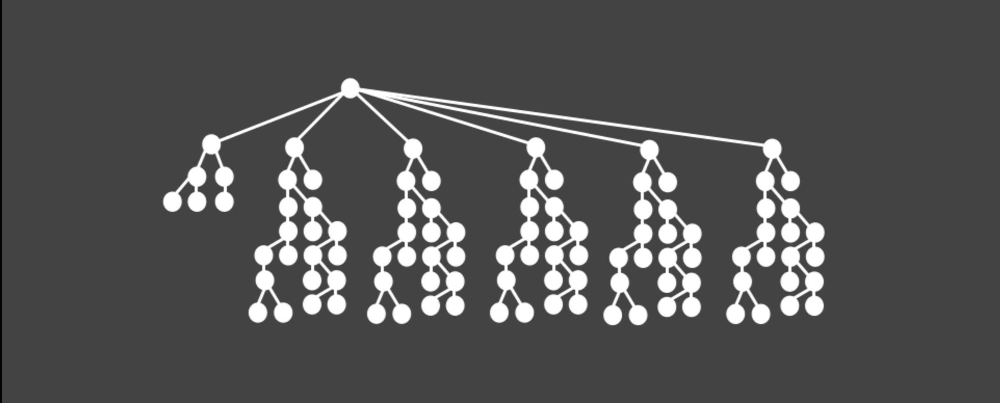

# Router

The structure of Angular 2 application can be viewed as the tree of components, with a root element of that tree being the entry point of your application.



In this setup the router `ui-view` is simply a node with multiple sub-branches.


## Component

A component is an object that structures and represents a UI element. It consists of two parts, component controller in charge of view logic and component template representing the view.

```js
// Angular 1.4
.directive('counter', function counter() {
  return {
    scope: {},
    bindToController: {
      count: '='
    },
    transclude: true,
    controller: function () {
      var vm = this;

      vm.increment = function() { this.count++; };
      vm.decrement = function() { this.count--; };
    },
    controllerAs: 'counter'
  };
});
```

```js
// Angular 1.5
.component('counter', {
  bindings: {
    count: '='
  },
  controller: function () {
    var vm = this;

    vm.increment = function() { this.count++; };
    vm.decrement = function() { this.count--; };
  }
});
```

🔗 For a more detailed introduction to `angular.component` see: [toddmotto.com/exploring-the-angular-1-5-component-method](http://toddmotto.com/exploring-the-angular-1-5-component-method)


## Modular Routes

While the traditional approach at writing an app's routing config is to dump all routing information in a single file, in larger apps, it may be beneficial to modularize the routes, but adding route config within each component/controller which could be used as a route.

🔗 [github.com/rangle/ci-gulp-angular/commit/d3e1303cbe97c5dae1d055eeb9c2716e5e16d204](https://github.com/rangle/ci-gulp-angular/commit/d3e1303cbe97c5dae1d055eeb9c2716e5e16d204)


## Route Config

Keeping with this modular approach, we can limit all the logic for a view to within the component itself. This would mean that your route definitions are limited to using `url` and `template` only. Where the template is the `view-component`. This way all the JS logic is contained within the component itself.

```js
$stateProvider
  .state('app', {
    url: '/',
    abstract: true,
    template: '<my-app-auth></my-app-auth>'
  })
  .state('app.main', {
    url: '^/main',
    template: '<my-app-dashboard></my-app-dashboard>'
  })
    .state('app.main.state1', {
      url: '/state1',
      template: '<my-app-state-1></my-app-state-1>'
    })
    .state('app.main.state2', {
      url: '/state2',
      template: '<my-app-state-2></my-app-state-2>'
    })
  .state('app.details', {
    url: '^/details/:id',
    template: '<my-app-details></my-app-details>'
  });
```
